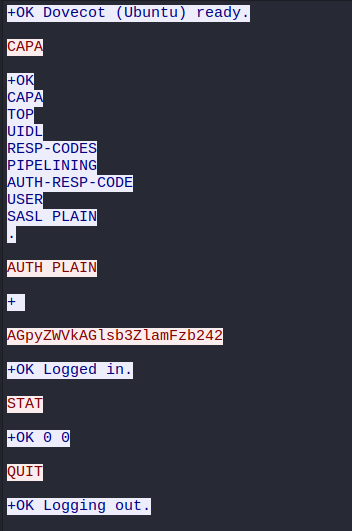
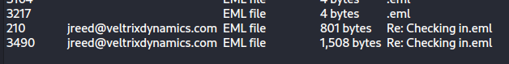
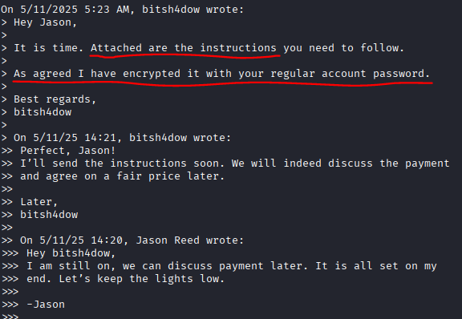
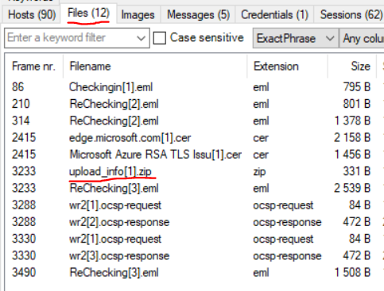

# Writeup: Insecure Exfil
## Team: mne00F
**Author:** Mheara

## Challenge
Find the flag in the provided PCAP

## Process

Open the PCAP in Wireshark, which immediately shows us POP (Post Office Protocol) communication - based on this, the task may be related to emails. 

Since POP is not really secure and it is right there, we can just get whatever we can from it (which will probably be useful later). Open the TCP stream to see:

The interesting part is `AGpyZWVkAGlsb3ZlamFzb242`, which has the user's credentials. Base64 decode it to get username `jreed` and password `ilovejason6`.

Given that we see mail activity, we can check for potential mail objects in the exported objects under IMF. This shows us two email objects from a `jreed@veltrixdynamics.com` (sounds familiar?) - save both of these.

Next, the 1508 bytes mail includes some interesting communication, especially:

So, we need to find an attachment. An assumption is a zipped file (given that it is password protected). The email objects did not seem to contain anything related to an attached file and it does not seem to be available as an HTTP object (if the file was downloaded). Instead of looking for the object manually, I decided to try NetworkMiner instead. Open the PCAP in NetworkMiner, go to the Files tab, then notice a zip called `upload-info[1].zip`.

Open this file by right-clicking, "Open file", then opening the `upload_info.txt` file. This file requires a password, which is `ilovejason6` (from the POP communication from earlier). Here we find the flag `EPT{3xf1l_pl4n5_1nf1ltr4t3d}`.