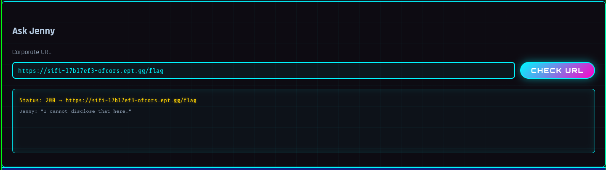

# SIFI - Of CORS I Can Help!

Author: `yrjarv`

---

"She’ll happily visit whatever link the portal hands her while staying logged in
as staff"

## Recon/initial assessment

By looking at the challenge description, we quickly see that `Jenny` probably
has read access to the flag.

When we download the file, we see in `src/main.py` line `174` that the so
helpful chatbot can't help us if the path starts with `/flag`.

```python
if urlparse(final_url).path.startswith("/flag"):
    # Hide restricted pages from the chat preview while navigation continues.
    preview_text = 'Jenny: "I cannot disclose that here."'
```

This seems to work "perfectly":



## Exploitation

By replacing any character in `/flag` with it's URL encoding (precent-encoding)
equivalent, we can pass the check mentioned above while still preserving the
meaning of the URL - and through that get `Jenny` to show us the flag. One
example of a valid URL is `https://sifi-17b17ef3-ofcors.ept.gg/%66lag`.


The flag is: `EPT{CORS_t0tally_trU5t5_y0u}`
