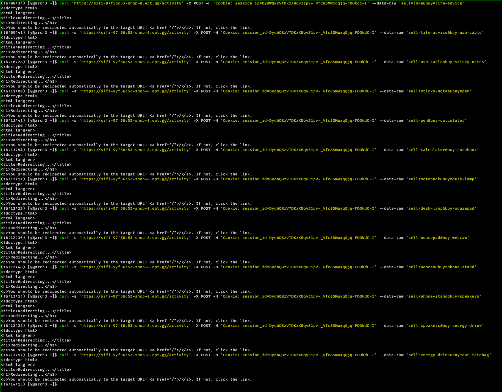
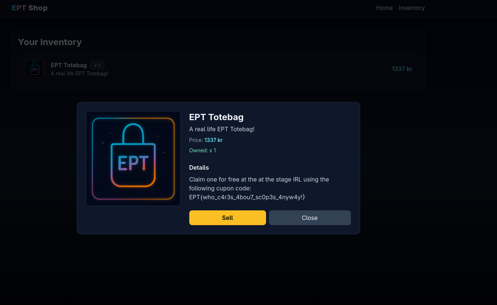

# SIFI - shop-8

Author: yrjarv

---

## Recon/initial assessment

By looking through `main.py`, it's not at first obvious where the vulnerability
is. All the SQL queries seem to be parameterized (i.e. not injectable), and the
logic seems sound.

However, there is one weird quirk with the `POST /activity` endpoint: If you
send a request to it containing both `sell` and `buy` values, it will first sell
and then buy. Okay, seems harmless enough. What is more concerning is how it
handles the variable `activity`:

```python
if "sell" in request.form:
    item_id = request.form.get("sell")
    owned = 0
    for activity in activity:
        if activity[1] == item_id:
            if activity[2] == "buy":
                owned += 1
            elif activity[2] == "sell":
                owned -= 1
    if owned >= 1:
        cursor.execute("INSERT INTO activity (session_id, item_id, type) VALUES (?, ?, 'sell')", (g.session_id, item_id))
        activity = [*activity, (g.session_id, item_id, "sell")]
        db.commit()
    else:
        return redirect("/")
if "buy" in request.form:
    item_id = request.form.get("buy")
    balance = 137
    for activity in activity:
        if activity[2] == "buy":
            balance -= items[activity[1]]
        elif activity[2] == "sell":
            balance += items[activity[1]]
    if balance >= items[item_id]:
        cursor.execute("INSERT INTO activity (session_id, item_id, type) VALUES (?, ?, 'buy')", (g.session_id, item_id))
        activity = [*activity, (g.session_id, item_id, "buy")]
        db.commit()
    else:
        return redirect("/")
```

When we sell an item, it uses the variable `activity` to iterate over
`activity`. Before the sell, `activity` is set to an array of tuples like so:

```python
[
    ("session_id_1", "joke", "buy"),
    ("session_id_1", "joke", "sell"),
    ("session_id_1", "joke", "buy")
]
```

But after the `for` loop, the value of `activity` is suddenly just the last
tuple in the array:

```python
("session_id_1", "joke", "buy")
```

If we actually have thhe item to sell, it then redefines `activity` as what will
now be an array of strings __and__ tuples:

```python
[
    "session_id_1",
    "joke",
    "buy",
    ("session_id_1", "joke", "sell")
]
```

This is due to the list unpacking operator `*` in python, which unpacks the
tuple `activity` into the new array `activity`.

So what does this mean? Well, since it doesn't exit we can then proceed to buy
an item. The logic that checks whether we have enough money to buy an item, is
as follows:

```
balance = 137, which is the default starting balance
for each element activity in activity:
    if whatever is on index 2 of activity is "buy":
        reduce balance with the correct amount
    else if whatever is on index to of activity is "sell":
        add the correct amount to balance
```

The problem with this is that after a sell, `activity` contains 3 strings and
one "sell"-tuple. Since `"session_id_1"[2]` is a character, neither of the if
statements in the pseudocode above will match. Only for the tuple it will match,
and because we just sold something that tuple will contain `"sell"` on index
`2`.

This leads to the balance becoming `137` plus the price of whatever we last sold
was. This lets us buy stuff we can't really afford. When we buy, it gets put
into the database, so we can then keep whatever we bought until we want to sell
it again.

## Exploit

The behaviour above can be abused in the following way:

1) Buy `joke` in the browser, as a normal user would
2) Repeate the API call that was made (make sure to use the same session ID!),
    but with the body `sell=joke&buy=life-advice`. Because we sell the joke we
    have a balance of `137kr + 99kr = 236kr`, more than enough to buy the
    `199kr` life advice.
3. Now we own one `life-advice` valued at `199kr`.
4. Repeat step `2` with `sell=life-advice&buy=usb-cable`, giving us a product
   worth `313kr`.
5. Repeat this until we are able to buy an `ept-totebag`



Now, we should own one `ept-totebag`. We can then go to the browser and look at
the details about our product:



The flag is: `EPT{who_c4r3s_4bou7_sc0p3s_4nyw4y!}`
